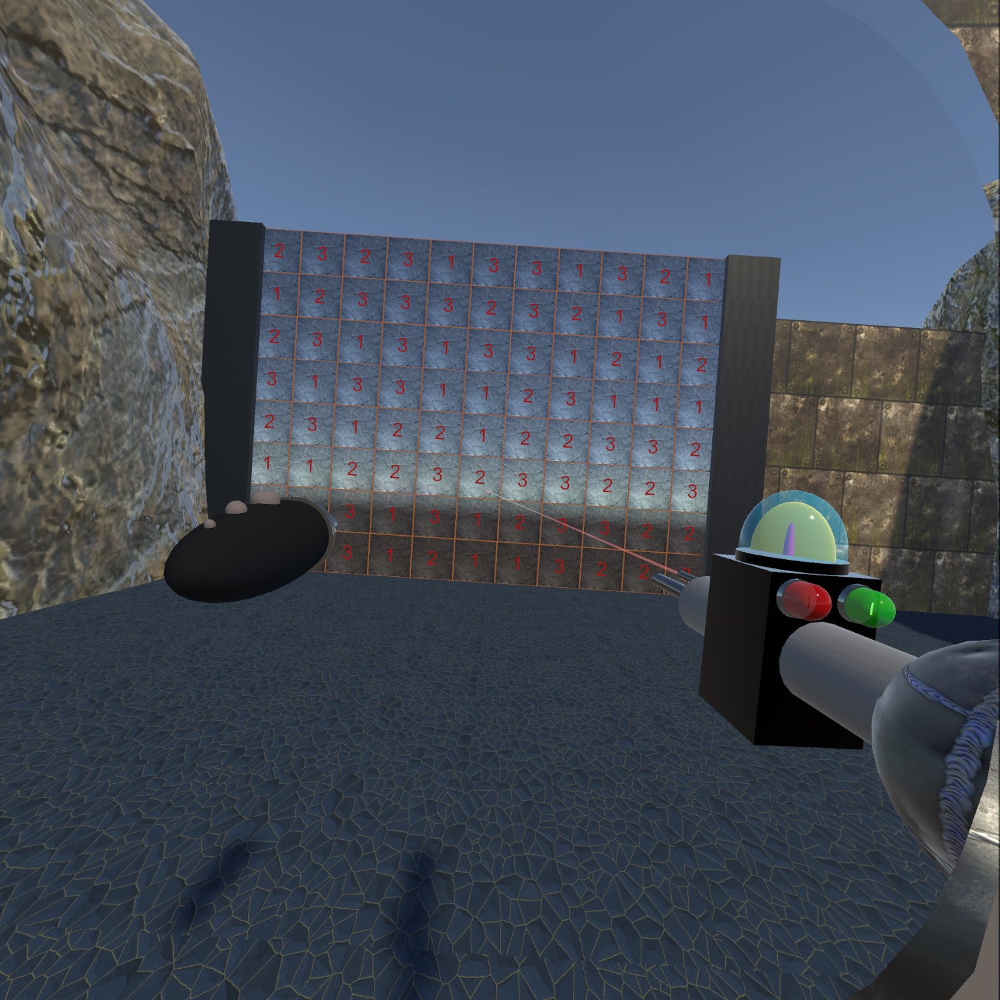

### I'm Pierce Krouse (pkrouse)

<!--
**pkrouse/pkrouse** is a ✨ _special_ ✨ repository because its `README.md` (this file) appears on your GitHub profile.

Here are some ideas to get you started:

- 🔭 I’m currently working on ...
- 🌱 I’m currently learning ...
- 👯 I’m looking to collaborate on ...
- 🤔 I’m looking for help with ...
- 💬 Ask me about ...
- 📫 How to reach me: ...
- 😄 Pronouns: ...
- ⚡ Fun fact: ...
-->
I'm a VR software engineer, specializing in the Unity platform, and currently learning the Fusion framework.  
My repos include:  
[Electricity](https://github.com/pkrouse/Electricity) 
  

Three electrical effects - Lightning, Jacob's Ladder, and a single arc.  These are all scripted with some vector math and line renderers. 
This one can be run in VR or directly in Unity, but you will want the full VR experience for this. 
A complete explanation of this project is on Medium in three parts: 
[Electricity in Unity — Part 1 of 3](https://medium.com/@pierce.krouse/electricity-in-unity-part-1-of-3-3424380f7b51), 
[Part 2 of 3](https://medium.com/@pierce.krouse/electricity-in-unity-part-2-of-3-2ba17f68097d), 
[Part 3 of 3](https://medium.com/@pierce.krouse/electricity-in-unity-part-3-of-3-522f923a516a)  
[Candy Crush Portal](https://github.com/pkrouse/CandyCrushPortal) 
   
I wrote a Candy Crush game strictly in C# for an assessment once, and decided to do it in VR. You have a brick wall, teleport tool, and a ray gun. 
Shoot out all the bricks to pass through.  
[Zombie on a Bicycle](https://github.com/pkrouse/ZombieOnABicycle) 
 
Fun with Mixamo animations and IK with Unity's Animation Rigging package. 
Explanation on Medium at [Intro to Animation Rigging in Unity](https://medium.com/@pierce.krouse/intro-to-animation-rigging-in-unity-71499d70e595)  
[Wall Switch in VR](https://github.com/pkrouse/WallSwitchInVR) 
I was experimenting with how to make a wall switch in VR.  Not my best work, but interesting IMO. 
Read the article first at [Implementing a wall switch in VR](https://medium.com/@pierce.krouse/implementing-a-wall-switch-in-vr-869b64885e49)  
[Geodesic Dome Experiments](https://github.com/pkrouse/DomeExperiments) 
Some geodesic domes I built in Blender and imported into VR. 

